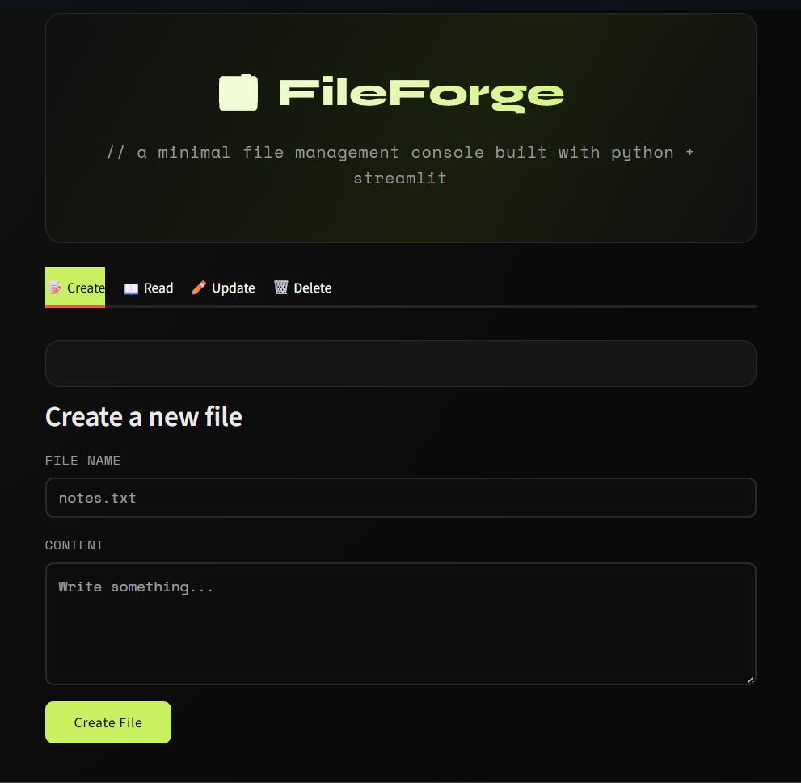

# 🗂️ FileForge — File Manager

A minimal file management console built with **Python** and **Streamlit**, featuring a dark, premium developer-portfolio UI.

🔗 **Live Demo:** [fileforge-tejas.streamlit.app](https://fileforge-tejas.streamlit.app)


## Features

- 📝 **Create** — make a new file with custom content
- 📖 **Read** — view the contents of any file
- ✏️ **Update** — rename, append to, or overwrite a file
- 🗑️ **Delete** — remove a file (with confirmation)

## Tech Stack

- Python
- Streamlit

## Run it locally

```bash
pip install -r requirements.txt
streamlit run file_manager_app.py
```

Then open `http://localhost:8501` in your browser.

## Screenshots



---

Built as a beginner Python project, wrapped in a Streamlit UI.
